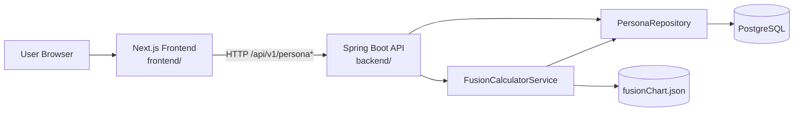

# VelvetFusion

Persona fusion calculator with a Next.js frontend and a Spring Boot + PostgreSQL backend.

## Repository Layout

```text
.
├── backend/                  # Spring Boot API
├── benchmarks/               # Phase 0 benchmark contract + run artifacts
├── frontend/                 # Next.js app (UI)
└── script/                   # Utility scripts
```

## Current Architecture



## Backend Layer Flow

Current request flow is intentionally simple:

1. `PersonaController` receives request (`/api/v1/persona`, `/fuse`, `/{name}`).
2. `FusionCalculatorService` handles fusion rule logic.
3. `PersonaRepository` handles DB reads via Spring Data JPA.
4. Fusion chart rules are loaded from `backend/src/main/resources/fusionChart.json`.

This maps to:

- Controller: `backend/src/main/java/com/velvetfusion/velvetfusion_api/controller/PersonaController.java`
- Service: `backend/src/main/java/com/velvetfusion/velvetfusion_api/service/FusionCalculatorService.java`
- Repository: `backend/src/main/java/com/velvetfusion/velvetfusion_api/repository/PersonaRepository.java`

## Tech Stack

### Frontend
- Next.js 15
- React 19
- Tailwind CSS 4
- Radix UI-based component primitives

### Backend
- Java 21
- Spring Boot 3.5
- Spring Web
- Spring Data JPA
- PostgreSQL

### Tooling
- Maven wrapper (`backend/mvnw`)
- npm + package-lock (`frontend/package-lock.json`)
- k6 benchmark contract under `benchmarks/`

## Project Docs

- Product scope: `USER_FEATURES.md`
- Roadmap: `velvetfusion_roadmap.md`

## Current API Surface

Base path: `/api/v1/persona`

- `GET /api/v1/persona` -> list personas
- `GET /api/v1/persona/{name}` -> fetch persona by exact name
- `GET /api/v1/persona/fuse?name1=A&name2=B` -> fusion result

## Local Development (Current)

Backend:

```bash
cd backend
./mvnw spring-boot:run
```

Frontend:

```bash
cd frontend
npm install
npm run dev
```

Expected local endpoints:
- Frontend: `http://localhost:3000`
- Backend: `http://localhost:8080`

Frontend API base is currently set through:
- `frontend/.env.local` -> `NEXT_PUBLIC_API_URL=http://localhost:8080/api/v1/`

## Phase 0 Baseline Assets

Benchmark baseline contract and artifact layout:
- `benchmarks/BASELINE_CONTRACT.md`
- `benchmarks/README.md`
